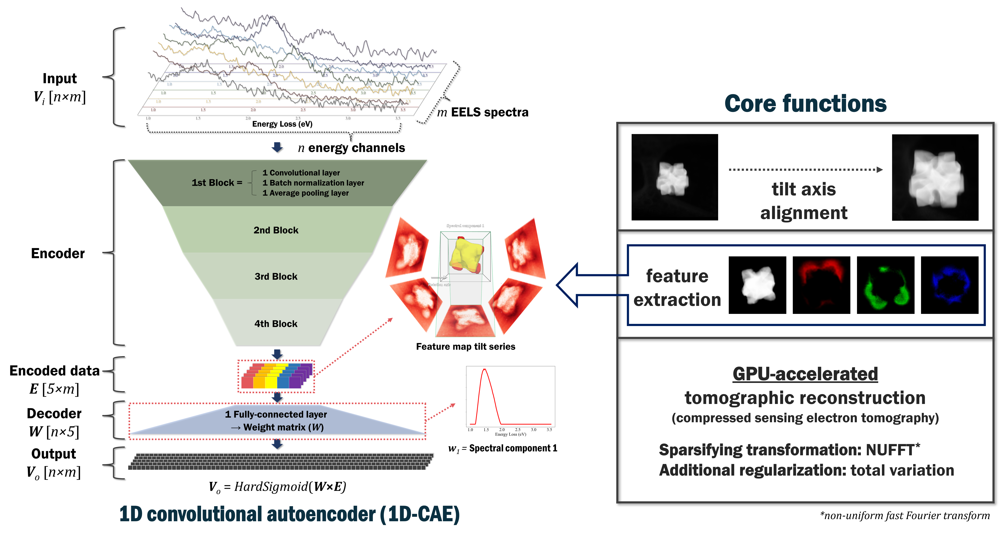

# CAETomo
The codes presented here are developed for EELS tomography data processing; the tilt axis alignment, feature map tilt series production and tomographic reconstruction can be achieved.

___
### How to install
<code>conda create -n caetomo python=3.10  
conda activate caetomo  
pip3 install torch torchvision --index-url https://download.pytorch.org/whl/cu126  
pip install torchkbnufft  
pip install tabulate  
pip install scikit-image  
conda install -c conda-forge opencv  
pip install hyperspy  
</code>
___
### Requirements
`# Generally required`  
`numpy`  
`matplotlib`  
`tifffile`  
`# Tilt axis alignment`  
`opencv`  
`ipywidgets`  
`scikit-image`  
`# Feature extraction and reconstruction`  
`drca # automatically installed with CAETomo`  
`pytorch`  
`tabulate`  
`torchkbnufft`  
___
### Application examples
1) Jo, J., et al., Direct Three-Dimensional Observation of the Plasmonic Near-Fields of a Nanoparticle with Circular Dichroism. ACS Nano, 2024. 18(47): p. 32769-32780.
2) Jo, J., et al., Comprehending nonmonochromatic plasmonic behavior of metal nanoparticles on dielectric nanowires using monochromated EELS. Physical Review Materials, 2025. 9(12).
___
### Citation
@article{jo2024eelstomo, 
author = {Jo, J., Ryu, J., Huh, J.-H., Kim, H., Seo, D. H., Lee, J., Kwon, M., Lee, S., Nam, K. T., Kim M.}, 
title = {Direct three-dimensional observation of the plasmonic near-fields of a nanoparticle with circular dichroism}, 
journal = {ACS Nano}, 
volume = {18}, 
Issue = {47}, 
pages = {32769–32780}, 
year = {2024}, 
doi = {[https://doi.org/10.1021/acsnano.4c10677](https://doi.org/10.1021/acsnano.4c10677)}
}
___
Jinseok Ryu, Ph.D. ([jinseuk56@gmail.com](mailto:jinseuk56@gmail.com))
